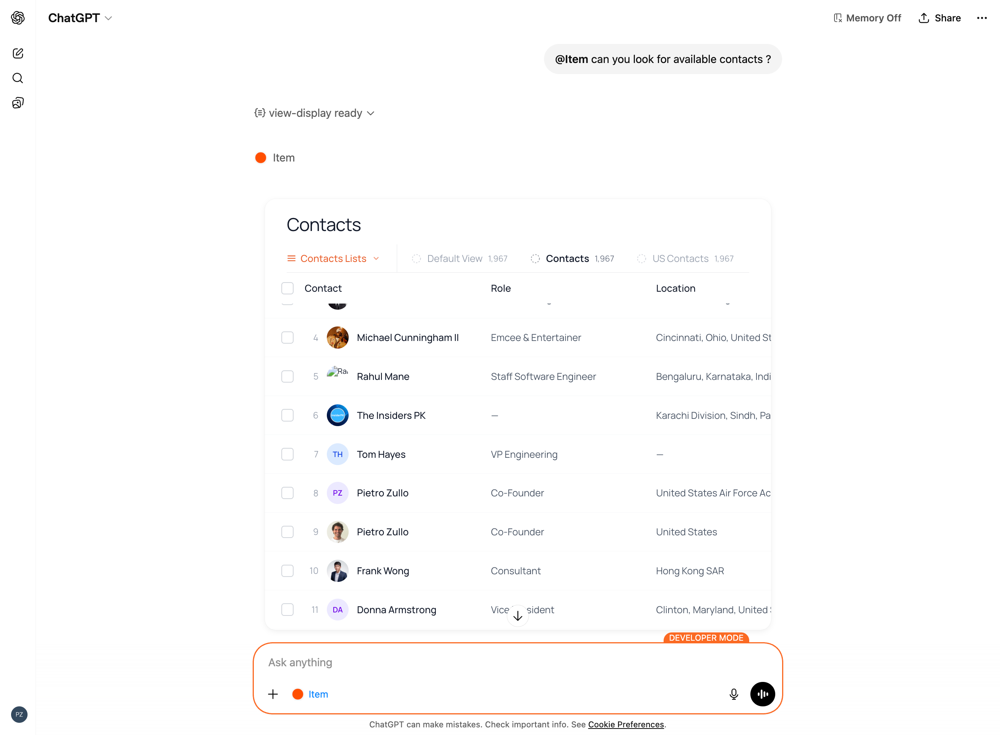

<p align="center">
  
</p>

# Item.app MCP Server

MCP server for [Item.app](https://useitem.io) — an agentic CRM. Exposes Item's CRM data (contacts, companies, deals, and custom objects) via MCP tools with live UI widgets.

<p align="center">
  
</p>

## Quick Start

```bash
npm install
npm run dev
```

The server starts at `http://localhost:3000`. Open the [Inspector](http://localhost:3000/inspector) to test tools interactively.

## Connecting

### With API key (recommended)

Each user authenticates by passing their Item API key in the connection URL:

```
http://localhost:3000/mcp?api_key=sk_live_YOUR_KEY_HERE
```

Get your API key from **Item.app > Settings > System**.

### Client configuration examples

**ChatGPT / Claude Desktop / any MCP client:**

```json
{
  "mcpServers": {
    "item-crm": {
      "url": "http://localhost:3000/mcp?api_key=sk_live_YOUR_KEY_HERE"
    }
  }
}
```

**Claude Code CLI:**

```bash
claude mcp add --transport http item-crm "http://localhost:3000/mcp?api_key=sk_live_YOUR_KEY_HERE"
```

### Local development (env var fallback)

For local development without a URL key, set the `ITEM_API_KEY` environment variable:

```bash
ITEM_API_KEY=sk_live_YOUR_KEY_HERE npm run dev
```

## Tools

| Tool | Description |
|------|-------------|
| `get-schema` | Get all object types and their field definitions. **Call this first.** |
| `get-objects` | List/search objects with pagination. Renders as table or kanban widget. |
| `get-object` | Get a single object by ID or email. Renders as a detail card widget. |
| `create-object` | Create a new object (deduplicates by email/domain). |
| `update-object` | Update an existing object's fields. |
| `delete-object` | Soft-delete an object (recoverable). |

### Typical workflow

1. Call `get-schema` to discover object types (`contacts`, `companies`, `deals`, etc.) and their fields
2. Call `get-objects` with an object type to browse data
3. Call `get-object` to drill into a specific record
4. Use `create-object` / `update-object` / `delete-object` to modify data

## Architecture

```
index.ts                    Main server — tools, middleware, helpers
src/lib/
  item-api.ts               Item REST API client (typed, error handling)
  item-types.ts             TypeScript types matching Item's OpenAPI schema
  api-key-store.ts          Per-request API key via AsyncLocalStorage
resources/
  view-display.tsx          Table/Kanban widget (main list view)
  object-card.tsx           Object detail card widget
  components/               ViewSelector, TableView, KanbanView
  lib/                      Shared types, constants, formatters, UI primitives
```

### Authentication flow

The API key is extracted from the URL query parameter in Hono middleware and bound to the async context via `AsyncLocalStorage`. Tool handlers read it transparently — no session state required.

```
Client connects to /mcp?api_key=sk_live_...
  → Middleware extracts key, wraps next() with AsyncLocalStorage
    → Tool handler calls getItemClient()
      → Reads key from AsyncLocalStorage, creates API client
```

## Deploy

```bash
npm run deploy
```

Deploys to Manufact Cloud. Set `MCP_URL` to your production URL and `ITEM_API_KEY` as a fallback.
